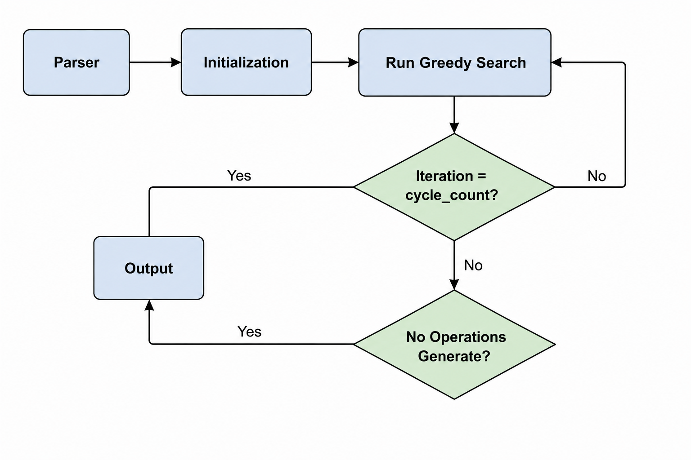
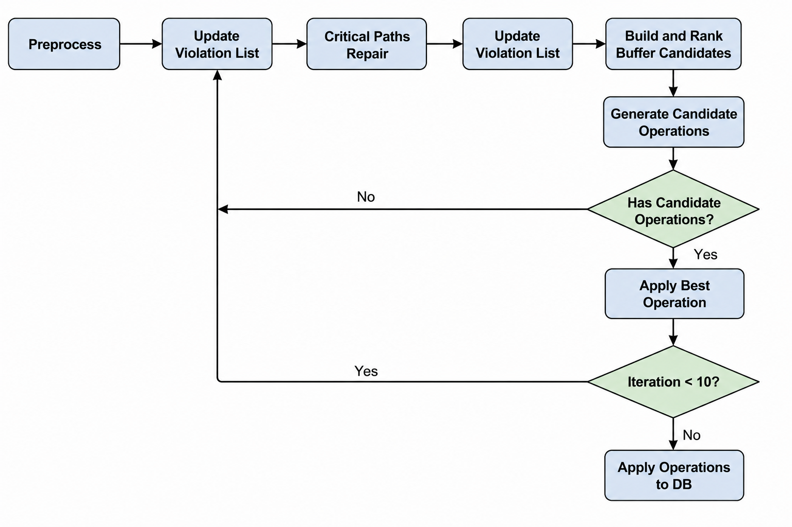

# ICCAD_Timing_Fixing_by_Useful_Skew
## ds.h README

### Purpose

`ds.h` 定義本專案 Step 1 所需的核心資料結構，用來建立 Clock Tree Model 與 Timing Path Model。

此檔案不負責 parsing，也不負責最佳化演算法，只提供後續 parser、SPFA、Bottom-Up DP 與 scoring 使用的共用資料格式。

---

### Main Data Structures

#### CellLib

用來記錄 `buf.lib` 中每種 buffer cell 的資訊。

包含：

- cell name
- width / height / area
- SS delay table
- FF delay table
- max fanout

delay table 使用 `fanout - 1` 作為 index。

---

#### TreeNode

用來表示 clock tree 中的每個節點。

節點可能是：

- Root
- Buffer
- FF

包含：

- node name
- node type
- parent / children
- buffer cell type
- fanout
- clock arrival time
- Euler tour interval

Clock tree 本身是後續 Bottom-Up DP 的主要結構。

---

#### FFInfo

用來另外記錄所有 FF 的資訊。

由於 timing path 都是 FF-to-FF，所以將 FF 從 clock tree 中獨立建立 index，方便後續查詢。

包含：

- FF name
- 對應的 tree node id
- SS / FF clock arrival time
- target arrival time
- target shift
- connected timing paths

---

#### TimingPath

用來記錄 `SS_delay.rpt` 與 `FF_delay.rpt` 中實際出現的 FF-to-FF path。

不建立完整 FF pair graph。

包含：

- launch FF
- capture FF
- SS data delay
- FF data delay
- setup slack
- hold slack
- critical flag

---

#### ConstraintEdge

用於 Step 2 的 SPFA / Bellman-Ford constraint graph。

每條 edge 表示：

```text
x[to] <= x[from] + weight
```

## Evaluator.h README

### Purpose

`Evaluator.h` 定義本專案 Step 4 所需的核心評估與輸出模組，用來執行 Top-Down 回溯、完整時序評估以及最終電路結構輸出。

此檔案承接 Step 3 Bottom-Up DP 傳遞至 Root 節點的 Top-K 候選狀態 (`DPState`)，透過沙盒模擬與多情境投票機制，選出最具強健性 (Robust) 的解答，並產生符合大會格式的修改後 Clock Tree 檔案。

---

### Main Mechanisms & Functions

#### Sandbox Simulation (沙盒模擬)

用來對 Step 3 產生的候選 `DPState` 進行安全的獨立測試，避免直接汙染主資料庫。

包含：
- 複製 `DesignDB` 以建立獨立沙盒環境
- 執行 `DPState.operations` 中的 `RESIZE_BUFFER` 與 `INSERT_BUFFER` 操作
- 動態更新 Tree Node 的 Parent-Child 指標與階層 (Level)

---

#### Full Timing Evaluation (完整時序評估)

用來獲取精確的時序與面積數據，消除 Bottom-Up DP 過程中的局部估算誤差。

包含：
- 呼叫 `sandbox_db.computeClockArrival()` 重新計算時脈到達時間
- 呼叫 `sandbox_db.computeAllSlacks()` 重新計算所有 Timing Path 的 Setup/Hold Slack
- 彙整與計算整體的 $TNS_{SS}$, $WNS_{SS}$, $TNS_{FF}$, $WNS_{FF}$ 以及 Total Area

---

#### Scenario Voting (多情境投票機制)

用來應對大會未公開計分權重 ($\alpha, \beta, \gamma$) 的盲測挑戰，確保選出的解答不會因為過度擬合單一指標而遭到重罰。

包含：
- 定義多種權重分配劇本 (如：Timing 優先、Area 節省優先、SS/FF 優先、絕對平均等)
- 讓 Top-K 候選人在每一套劇本的公式中進行計分對決
- 統計各候選人贏得的「劇本冠軍數 (票數)」
- 選出得票數最高、各項指標最均衡的強健解 (Robust Winner)

---

#### Tree Realization & Output (電路實體化與輸出)

用來將最終勝出的解答正式套用，並產生比賽要求繳交的檔案。

包含：
- 將勝出者的 `operations` 正式 Commit 到主程式的 `DesignDB`
- 利用 DFS (深度優先搜尋) 走訪修改後的 Clock Tree
- 匯出符合比賽規定格式的 `modified_clk_tree.structure`

## SPFA.h README

由於把SS和FF分開比較好做，我在ds.h加了個buildConstraintGraph(ConstraintKind kind)
原本定義
hold:
x_capture - x_launch <= FF_data_delay - Thold = weight
edge:
launch -> capture

但考量到縮小 x_capture 比增加 x_launch 難的多，我將其改成
x_launch - x_capture >= -weight
edge:
capture -> launch

在固定 x_capture 的情況下，藉由增加 x_launch 來符合條件
(我沒有改原本的定義，只是在buildConstraintGraph中的from和to交換而已)

## Greedy Search

### Framework
**Frame Work**

- Parser：讀取和建立資料結構，計算初始slack。
- Initialization：預先建立所需的資料結構，如subtreeFFs, FFtoPaths和Path的capture Buffers，Launch Buffers等等。
- Run Greedy Search迭代：生成能夠解決negative slack的operations。
- Output：輸出modified_clk_tree.structure。


**Run Greedy Search**


- **Preprocess**：初始化nodeOperationState，將每個node的modifed都設為false，代表這個節點還未被修改。
- **UpdateViolationLists**：建立 violation paths，並根據 negative slack 平方總和進行排序。
- **Critical Paths Repair**：選出前 15 條violation paths作為本次迭代要修復的 critical paths。每完成一輪修復後，都會重新更新 violation paths。
- **Build and Ranked Buffer Candidates**：選取前一定比例（例如前 50%）的 violation paths，根據前面建立的資料結構，對這些paths經過的 buffers 進行加權，並依照權重排序，產生 Candidate Buffers。
- **Generate Candidate Operations**：針對每個 Candidate Buffer 產生 Resize 和 Insert 等 Candidate Operations，計算 score 並排序。
-- 有Candidate Operations產生，進入ApplyBestOperation。
-- 沒有Candidate Operations產生，回到更新violation list，進入下一次迭代。
- **Apply Best Operations**：依照 score 套用最佳的操作，並更新node的State，包括 node 的modified以及 path 的 slack 變化。
-- Tips：因為這些 operations 都是根據同一次迭代開始時的 timing 計算，因此會限制每次實際套用的 operation 數量，避免後續操作仍依據已經過時的 slack 資訊。
-- 未達到迭代次數上限，繼續下一輪 Greedy Search迭代。
-- 已達到迭代次數上限，就會將累積的 operations 進入到Apply Operations to DB實際套用到 Clock Tree上，完成這次的Run Greedy Search的迭代。


### Initialization：預先建立常用的資料結構
基於三個方向：Tree Nodes，Flip-Flops，Paths
1. 基於Tree Nodes：``` vector<vector<int>> SubtreeFFs ```
-- 使用``` InitializeSubTreeFFs ```初始化和``` UpdateSubtreeFFs ```更新每個node底下有哪些Flip-Flops。
-- 優點：當我們修改node的時候可以快速知道有哪些Flip-Flops會受到影響。

2. 基於Flip-Flops：``` vector<vector<PathInfo>> FFtoPaths ```
-- 使用``` buildFFtoPaths ```建立FF到path的對應關係，記錄每個FF參與的Timing Path，以及它在path中是capture或launch的那邊。
-- 優點：當某個FF的timing改變的時候能夠立刻找到所有受影響的timing paths並更新slack。

3. 基於Paths：``` struct Path ```
-- ``` int LCANode ``` 代表path的capture FF和launch FF的最近共同祖先。
-- ``` vector<int> captureBuffers ``` 代表從LCA到captureFF路徑上的所有buffers。
-- ``` vector<int> launchBuffers ``` 代表從LCA到launchFF路徑上的所有buffers。
-- 優點：在Greedy Search時不需要反復遍歷clock tree尋找路徑，可以直接取得需要評估的buffers。

#### 一些參數
1. ``` double weight_violations ``` 代表找bufferCandidates的時候要看前多少%的violation paths，cleanMode為false就是初始化為0.5，每次Greedy Search+0.05，逐步提升考慮的violation paths的量；cleanMode為true代表Run Greedy Search迭代超過一定次數或是critical_to_solve的值大於15，這時就要開始考慮全部的violations，所以weight_violations初始化為1.0。
2. ``` critical_ss_threshold ``` 代表每次修復setup critcial paths時setup negative slack的目標，目前是設置-0.05 -> +0.01。
3. ``` critical_ff_threshold ``` 代表每次修復hold critcial paths時hold negative slack的目標，目前是設置-0.05 -> +0.01。
4. ``` critical_limit ``` 代表每次修復setup/hold corner時另一個corner能接受的惡化極限，目前是設置+0.02 -> -0.001。
*箭頭代表cleanMode*
5. ``` critical_to_solve ``` 代表Greedy Search的Critical Paths Repair中要修好的Critical Paths數量。


<!--
## clk_tree_dp.h README

`clk_tree_dp.h`定義本專案step 3的 Bottom-Up Dynamic Programming (DP) 。
這一步主要是對 Clock Tree 進行優化，透過調整 Clock Buffer 的配置來改善 Timing 表現。

目前支援三種操作：

NoOp：不做修改
Resize：更換 Buffer Cell
Insert：插入新的 Buffer

DP 會由 FF 葉節點往上遞迴計算，在每個節點保留較佳的候選解，最後於 Root 取得最佳修改方案。

### 演算法流程
```mermaid
graph TD
    A[FF Leaf] -> B[Merge Children]
    B -> C["Expand
    (NoOP / Resize / Insert)"]
    C -> D[Evaluate]
    D -> E[Prune]
    E -> F[Return States]
```

### DP State
每個候選解以 `DPState` 表示。

主要紀錄：

- `ssDelayDelta`：SS Corner 延遲變化量。
- `ffDelayDelta`：FF Corner 延遲變化量。
- `areaDelta`：面積變化量。
- `sssumTargetShift`：所有 FF 的 SS Target Shift 總和。
- `ffsumTargetShift`：所有 FF 的 FF Target Shift 總和。
- `ffCount`：此 State 包含的 FF 數量。
- `estimatedGain`：評分結果。
- `operations`：紀錄所有修改操作。

### Functions

#### Leaf Initialization
當節點為 FF 時建立初始狀態：

Delay Change = 0
Area Change = 0
將 FF 的 Target Shift 存入 State
ffCount = 1

作為 DP 的起始狀態。

#### Merge
將多個Child的DP結果合併。

- TargetShift：直接加總。
    `sumTargetShift = ChildA + ChildB`
- Delay：使用加權平均。
    `Delay = (DelayA × CountA + DelayB × CountB) / TotalCount`
- Area：直接累加。
    `Area = AreaA + AreaB`
- Operations：將兩個Child的操紀錄合併。
- *Merge之後會先做一次排序（通過EstimatedGain），避免候選解數量爆炸。*

#### Expand
Merge完成後，對每個State嘗試不同修改方式。

- 1. NoOP
    維持原本buffer不變。
    用途：保留原始解，作為其他操作的比較基準。

- 2. Resize
    嘗試將目前Buffer換成Library中其他合法Cell。
    更新：SS Dela, FF Delay, Area，並記錄Resize Operation。

- 3. Insert Buffer
    在節點與其Parent之間插入新的Buffer。
    從
    ```mermaid
    graph TD
    A{Parent} -> B{U}
    ```
    變成
    ```mermaid
    graph TD
    A{Parent} -> B(New Buffer)
    B -> C{U}
    ```
    更新：SS Dela, FF Delay, Area，並記錄Resize Operation。
- *三種操作之後也會先做一次排序（通過EstimatedGain），避免候選解數量爆炸。*

#### Evaluation
每個State會計算一個分數(`EstimatedGain`)。
目前使用：
```
Error = |TargetSS - DelaySS| + 3 ×|TargetFF - DelayFF|
```
再加上面積成本：
```
Gain = -(Error + λ × Area)
```
其中：SS 為主要優化目標，FF 次要考量，λ 為面積權重。
Gain 越大表示解越好。

#### Pruning
為避免State數量爆炸，使用三層Pruning。
- Pareto Pruning
    刪除明顯較差的State。
    若State A的Error更小，SS誤差更小，則視為支配(Dominate) State B。
    
- Bucket Pruning
    依據SS Delay分桶：
    ```
    Bucket = round (SSDelay / Precision)
    ```
    每個Bucket只保留前幾名解。
    參數：
    ```
    bucketPrecision
    bucketKeep
    ```
- Top-K Pruning
    最後依照Gain排序。
    只保留 `topK` 個最佳解。
    
#### Important Parameter（重要參數）
| 參數 | 功能 |
|:--|:--|
| lambda | 面積懲罰權重 |
| topK | 每個節點保留的最大State數量 |
| bucketPrecision | Bucket分桶精度 |
| bucketKeep | 每個Bucket保留數量 |

-->